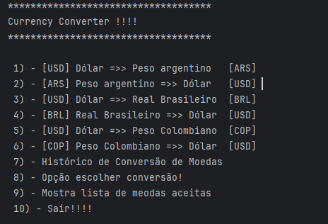
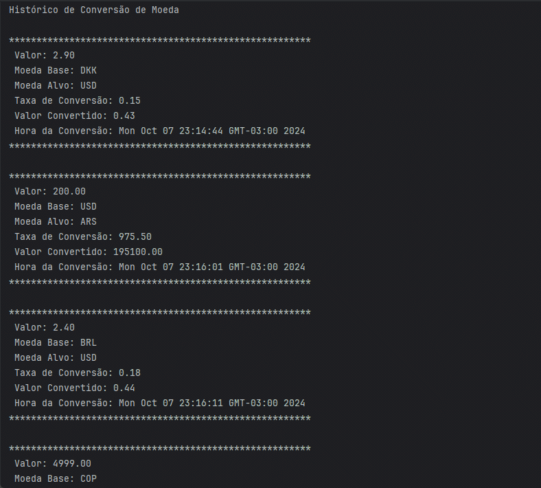

### 🪙 Currency Converter 🪙
## 📖 Sobre
Neste projeto, busca-se uma forma de converter a moeda de um país para a de outro de maneira fácil e rápida. Ele utiliza uma API gratuita de conversão de moedas, na qual é possível informar a moeda base e a moeda alvo para a qual se deseja realizar a conversão.

### 📜 Detalhes
#### 🪛 Menu
Com um menu fácil de entender e usar, o usuário pode escolher entre opções pré-definidas ou selecionar suas próprias moedas. Além disso, há a possibilidade de converter e monitorar suas conversões de forma prática e eficiente.

<tr> 
⚙️ Funcionalidades

<strong>Opção pré-definida</strong>

 

<strong>Histórico de conversões</strong>
 
 

<strong>Escolher suas próprias moedas</strong>
 

